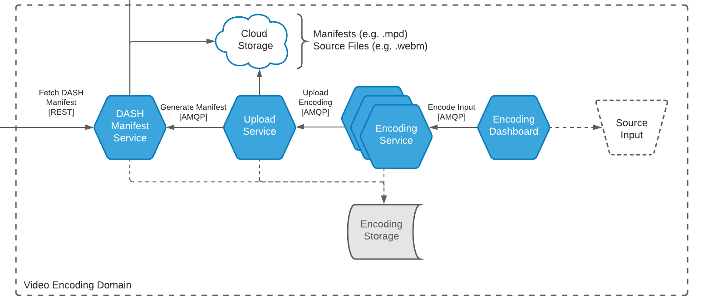

# Gakuen (学園)
A modular distributed VOD/streaming pipeline built on Node.js.

## Overview
The Gakuen pipeline is a collection of microservices designed to support a
video on-demand (VOD) / streaming platform.

Each microservice should be replicable to a language of one's choice.
Each service is also deployable as Docker containers for whatever
service supports it such as EC2. Currently, Gakuen provides instant support with
Docker Compose using the `docker-compose.yml` config file and Dockerfiles
provided.

Each service is also deployable on bare-metal with just a few adjustments by
directly running each service with Node. It's also possible to deploy the system
as a simple monolith by using Node's package functionality.

### Encoding Pipeline
- Kaichou (会長) - Source Collection & Inspection
- Fukukaichou (副会長) - Source Input Dashboard
- Otetsudai (お手伝い) - FFMPEG Encoder
- Kaikeishi (会計士) - Converted Media Cloud Uploader
- Shoki (書記) - DASH Manifest Generator & API Endpoint

The encoding pipeline is a collection of services designed to support the
collection, encoding, and availability of media files into the VOD system.
In other words, this pipeline provides the ability to take movies/shows,
inspect them, encode them, and optionally upload them to some database or
cloud storage and generate streaming manifests to make them available on
a VOD/streaming website.



A few problems for me have been separating the encoding, uploading, and manifest
services since they all require access to the encoded media files. Using Docker,
the services can share a common *media* volume. But right now I don't see how
these services can be scaled using some cloud-based solutions like AWS.

My current thoughts would be to somehow *stream* the encoded output to the
upload service (which may be able finally stream it to the cloud). To make it
possible for the encoders to work in parallel and scale horizontally, they
cannot stream the media itself to storage.

## Running
The pipeline is currently designed to run on containers, so it may be deployed
on a single-machine, or distributed over multiple machines.

This repository supports **Docker Compose** right of the box, so if you want to
run this on a single machine, make sure you have [Docker](https://www.docker.com/)
installed, and simply enter:

```bash
$ docker-compose up
```

--------------------------------------------------------------------------------

Gakuen is a project of mine to study microservice architecture, learn new languages
and protocols, and practice the implementation of various patterns.
A lot of inspiration was taken from [Netflix's Medium TechBlog](https://netflixtechblog.com/),
where the kind Netflix engineers shared their processes, struggles, and achievements.